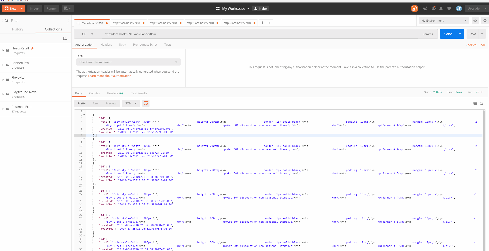

*Code test for bannerflow*

## Setting up

1. Requires .NET Core 2.2
2. Clone the repo and open in Visual Studio
3. Execute `dotnet restore` in the package manager console. The only package used is `Microsoft.EntityFrameworkCore.InMemory`
4. Build and Run the app

## Testing
Use any api testing tool like [post man](https://www.getpostman.com/).

`GET http://localhost:55918/api/Bannerflow`  
Will return all the available banners in database

`GET http://localhost:55918/api/Bannerflow/3`  
Will return a banner with id = 3

`GET http://localhost:55918/api/Bannerflow/5/Render`  
Will render banner with id = 5

```
POST http://localhost:55918/api/Bannerflow

Headers:
"Content-Type": "application/json"

Request Body:
{
    "id": 15,
    "html": "<div><p>Buy 1 get 1 Free</p><br/><p>Banner # 15</p></div>"
}
```
Will create a new banner with id 15

```
PUT http://localhost:55918/api/Bannerflow/15

Headers:
"Content-Type": "application/json"

Request Body:
{
    "id": 15,
    "html": "<div><p>Buy 2 get 3 Free</p><br/><p>Banner # 15</p></div>"
}
```
Will update banner with id = 15

`DELETE http://localhost:55918/api/Bannerflow/15`  
Will delete banner with id = 15

## Demo


## Development Instructions
* The coding style is inspired from domain driven design.
* This sample uses In-Memory database.
* The app auto-generates 10 banners in the database when the Service is called for the first time.
* Corner cases, exception handling and logging is not implemented.